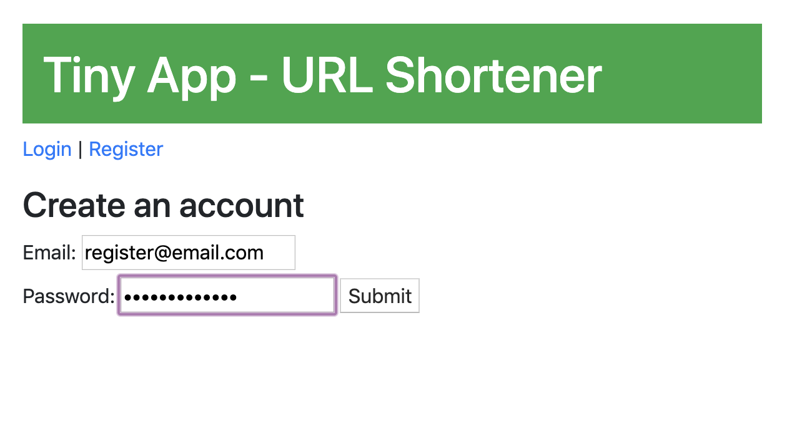
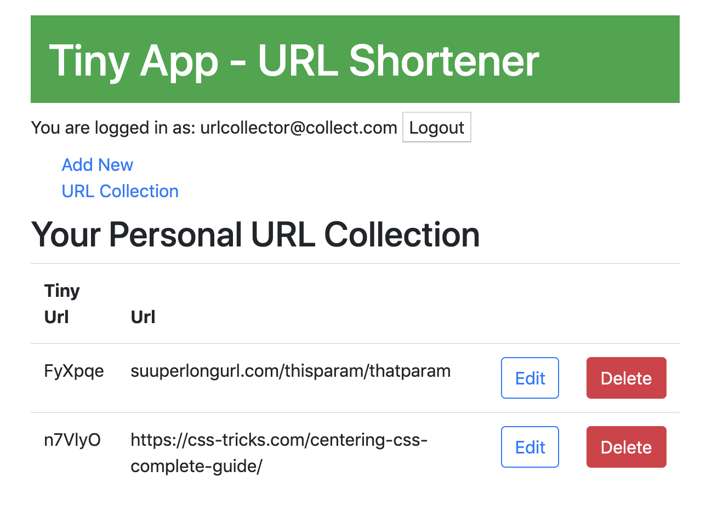

#Project Description

Tiny URL is a tool to shorten long URLs. This web app uses Node and Express to build a simple web server and practise using http routes

##Goal
This four-day project helped build a web app using Node. The app will allow users to shorten long URLs much like TinyURL.com and bit.ly do.

I built a HTTP Server that handles requests from the browser for the user. I learned to use Express, a web framework that uses handlers for HTTP requests.

https://web.compass.lighthouselabs.ca/projects/w2-url-shortener

## Getting Started

1. Install the following dependencies (use 'npm install' command)
2. Run the development web server using the 'node expres_server.js' command
3. Go to <http://localhost:8080/> in your browser.

## Dependencies

- Node.js
- Express
- Embedded Javascript
- bcrypt
- body-parser
- cookie-session
- cookie-parser (briefly)

## Final Product

Here is the registration page

Here is the url collection 
